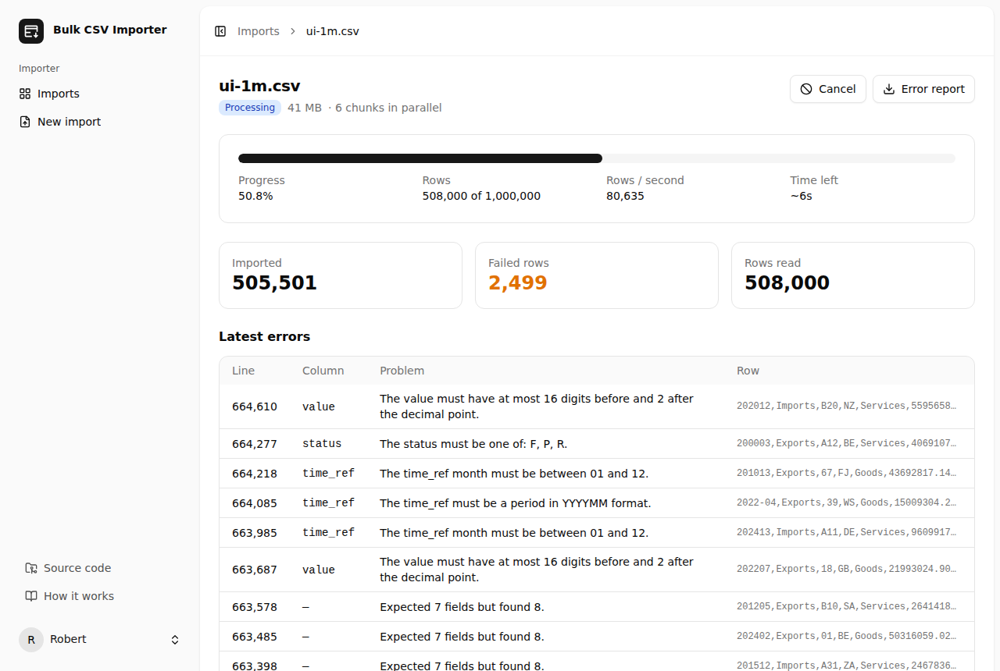
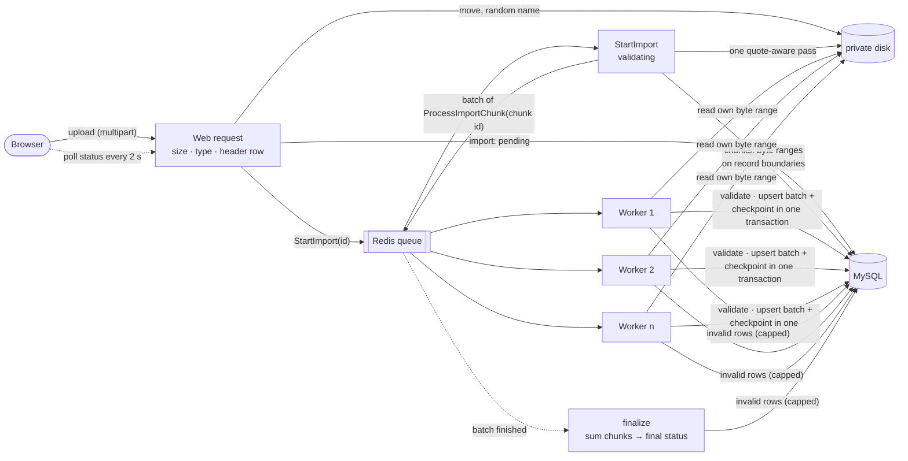

# Bulk CSV Importer

Import millions of CSV rows into MySQL **reliably, quickly and safely, with
flat memory use**, and watch it happen live in the browser.

The first version of this project was a small Laravel app that accepted a CSV
upload, cut it into 100-row chunks and processed them as a queued batch. It
works for a few thousand rows. At a million rows it runs out of memory. This
rebuild solves the same problem properly and measures both versions on the
same machine, with the same data.

## Before and after: 1,000,000 rows

| | Before (original) | After, sequential | After, parallel (4 workers) |
|---|---:|---:|---:|
| **Wall time** | **fails** at PHP's default 128 MiB limit; 1,220 s (20 min) with no limit | **32.6 s** | **11.1 s** |
| **Rows / second** | 820 | 30,666 | 89,791 |
| **Peak memory** | 223 MiB in the upload request, growing with the file | **46.5 MiB per job** (75 MiB worker RSS), flat from 10k to 5M rows | same, per worker |
| Bad row | crashes its chunk; the rest of the chunk is lost | reported (line, column, reason), import continues | same |
| Worker killed mid-import | rows lost | resumes from last batch, exact counts | same |

5M rows: 157 s sequential, 51 s parallel, same memory.

Measured on a 4 vCPU / 15 GiB cloud VM with MySQL 8.4 (binary log on, fully
durable commits) on the same machine. Every number, the exact commands and
the full sweeps are in **[docs/BENCHMARKS.md](docs/BENCHMARKS.md)**.



## How it works



1. **Upload.** Authenticated users only. Size, extension, sniffed content
   type and the **header row** are checked before anything is stored or
   queued. The file goes to a private disk under a random name.
2. **Validate and split** (queued job). The header is mapped by name, in any
   order. In parallel mode, one streaming pass finds byte offsets that are
   safe to split at, which needs **quote state**: a quoted field may contain
   newlines, so "seek, then find the next `\n`" would cut records in half.
   The same pass counts the rows exactly.
3. **Process** (job batch). Each job gets a chunk id, never row data, and
   streams its byte range with league/csv. Rows are validated by the
   importer definition, then written in batches with an upsert on
   `(import_id, line_number)`. Each batch commits **with** the chunk's
   counters and resume point, so a killed worker resumes where it stopped
   and nothing is ever written twice.
4. **Report.** Invalid rows are recorded (line, column, message, excerpt)
   without stopping the import, up to a cap; a configurable error rate fails
   it early. The UI polls a light status endpoint for progress, rows/s and
   ETA, and offers the errors as a CSV safe to open in a spreadsheet.

Status lifecycle: `pending → validating → processing → completed |
completed_with_errors | failed | cancelled`, with one transition table and a
conditional update so two actors (a finishing worker and a user pressing
Cancel) cannot both win. **Cancel** stops the remaining chunks; **Retry**
re-runs only the chunks that failed.

## Key decisions and trade-offs

- **Parallel by default, with small chunks.** Parallel was never slower
  than sequential and was 2.4–3× faster from 100k rows up. 2 MiB chunks
  beat 8 MiB ones (10.9 s vs 14.3 s at 1M rows): more chunks than workers
  keep every worker busy until the end. Sequential mode is kept; it needs
  no pre-scan and is the simplest thing that works.
- **2,000 rows per insert batch.** Fastest in the sweep (500: +18% time;
  5,000–10,000: slightly slower and more memory). One batch = one
  transaction = rows + the chunk's checkpoint.
- **Idempotency from the data, not from the queue.** The data table's
  primary key is `(import_id, line_number)` and every write is an upsert, so
  replaying a batch is harmless; checkpoints just avoid the rework. Upsert
  with a no-op update rather than `INSERT IGNORE`, which would also hide
  real data errors. No foreign key and no secondary indexes on the data
  table: they would cost on every inserted row and nothing queries them.
- **Line numbers are record numbers.** With quoted newlines, a file's
  physical lines and its CSV records differ; errors report the record
  number (the header is 1), which is what a spreadsheet shows as the row.
- **Not `LOAD DATA`.** It loads 1M rows in 4.7 s, 2.4× faster, but with
  `LOCAL` it coerces bad values (`N/A` → `0.00`), stores invalid enums and
  reports only a warning count. Validation and per-row errors are the
  point of this tool, and `LOCAL INFILE` is a security liability, so it
  stays off. Measured and explained in
  [docs/BENCHMARKS.md](docs/BENCHMARKS.md#load-data-comparison).
- **Validation rules are plain objects, not Laravel's validator,** because
  they run per cell, millions of times. Values such as `DECIMAL(18,2)` stay
  strings all the way to MySQL, never floats.
- **Chunk counters are the source of truth while running.** Each chunk's
  counters are written in the same transaction as its rows, so the status
  endpoint sums a few dozen chunk rows instead of counting millions, and
  the sums stay exact across retries. The error cap is enforced exactly
  across workers with a short lock on the import row.
- **Polling, not websockets.** A 2-second poll of one small endpoint is
  enough for a progress bar and needs no extra infrastructure.

## Run it

Requirements: Docker with Compose, and `make` (on Windows, see [Windows](#windows)).

```bash
git clone https://github.com/RDBagwell/bulk-csv-importer.git
cd bulk-csv-importer
make up
```

`make up` copies `.env.example` to `.env`, builds the app image, starts
**app** (PHP-FPM + nginx), **horizon** (queue workers), **scheduler**,
**MySQL 8.4**, **Redis** and **Mailpit**, installs dependencies, builds the
front end and runs the migrations. Then:

- App: <http://localhost:8080> (register an account, then **New import**)
- Horizon: <http://localhost:8080/horizon>
- Mailpit (password-reset mail): <http://localhost:8025>

Other targets: `make test`, `make lint`, `make analyse`, `make shell`,
`make logs`, `make down`. On a host without IPv6, set
`NGINX_LISTEN_IP_PROTOCOL=ipv4` in `.env`.

### Windows

Use WSL2. The Makefile is POSIX shell, and Docker reads files from the WSL
filesystem far faster than from a Windows drive.

1. In an administrator PowerShell: `wsl --install -d Ubuntu`, then restart
   and open **Ubuntu** from the Start menu.
2. In Docker Desktop: **Settings → Resources → WSL Integration**, enable
   **Ubuntu**, **Apply & restart**.
3. In the Ubuntu terminal, clone into your Linux home directory (not under
   `/mnt/c`, and not in a OneDrive folder, which would try to sync
   `vendor/` and `node_modules/`):

   ```bash
   sudo apt update && sudo apt install -y make git
   cd ~ && git clone https://github.com/RDBagwell/bulk-csv-importer.git
   cd bulk-csv-importer && make up
   ```

4. Open <http://localhost:8080> in your Windows browser.

Without WSL, the same steps as `make up` from PowerShell (slower, because
the code is shared from the Windows drive):

```powershell
Copy-Item .env.example .env
docker compose up -d --build --wait app mailpit
docker compose exec app composer install --no-interaction
docker compose exec app php artisan key:generate
docker compose exec app npm ci
docker compose exec app npm run build
docker compose exec app php artisan migrate --force
docker compose up -d --wait
```

Tests: `docker compose exec app php artisan test` and
`docker compose exec app npm test`.

### Large uploads

One variable, `UPLOAD_LIMIT` in `.env` (default `1100M`), sets nginx's
`client_max_body_size` and PHP's `upload_max_filesize` and `post_max_size`
in the containers; `IMPORTER_MAX_UPLOAD_KB` (default 1 GiB) is what Laravel
validates and what the browser checks before uploading. Keep `UPLOAD_LIMIT`
slightly above the Laravel limit for multipart overhead. If they disagree,
the smallest wins: nginx answers 413, PHP drops the file, and only the
Laravel limit produces a friendly message. Outside Docker, set the same
three PHP/nginx values yourself (`php artisan serve` uses your CLI
`php.ini`, whose default `post_max_size` is 8 MiB).

### Configuration

All importer settings live in [`config/importer.php`](config/importer.php)
and can be set from `.env`: mode (`auto`, `sequential`, `parallel`), chunk
size, insert batch size, worker count, retries, error cap and threshold,
retention, upload limits and rate limit.

## Generate data and benchmark

```bash
# Seeded, streamed to disk; the same seed always gives the same bytes.
php artisan importer:generate 1000000                      # storage/app/generated/trade-1000000.csv
php artisan importer:generate 100000 --errors=1 --quoted-newlines --out=/tmp/messy.csv

# One end-to-end import with real queue workers; prints wall time, rows/s and memory.
php artisan importer:benchmark storage/app/generated/trade-1000000.csv --mode=parallel --workers=4
php artisan importer:benchmark storage/app/generated/trade-1000000.csv --mode=sequential --batch-size=5000

# Crash test: SIGKILL a worker mid-import and check the counts are still exact.
IMPORTER_RETRY_AFTER=15 php artisan importer:benchmark trade-1000000.csv --mode=sequential --kill-worker-after=8

# The whole suite behind docs/BENCHMARKS.md, and the tables.
benchmarks/run-suite.sh storage/app/generated
php benchmarks/summarize.php storage/benchmarks/results.jsonl
```

The benchmark truncates the data table, so it refuses to run in production.
Stop Horizon first so it does not compete for the queue.

## Tests

```bash
php artisan test   # Pest: unit + feature, SQLite in memory (CI also runs them on MySQL)
npm test           # Vitest
```

Covered: the splitter (quoted newlines, CRLF, BOM, missing final newline,
empty file, stray quotes, plus a fuzz test against a whole-file parse);
header validation; every validation rule; the error cap and threshold;
idempotency (a chunk processed twice, and a worker killed mid-chunk);
state transitions, cancel and retry-only-failed; authorization for every
action; CSV injection in the export; an end-to-end import of a generated
10k-row file with 1% bad rows, with exact counts; the progress component
and the upload checks.

## What to look at

- **The splitter**: [`app/Importing/Csv/RecordBoundaryScanner.php`](app/Importing/Csv/RecordBoundaryScanner.php)
  and the byte-range reader [`RangeReader`](app/Importing/Csv/RangeReader.php) /
  [`ByteRangeStream`](app/Importing/Csv/ByteRangeStream.php).
- **The importer definition**: [`app/Importing/Definitions/TradeStatisticsDefinition.php`](app/Importing/Definitions/TradeStatisticsDefinition.php),
  its [`ImportDefinition`](app/Importing/Definitions/ImportDefinition.php) contract and the
  [rules](app/Importing/Rules). A second dataset is a new class plus a migration.
- **The idempotent insert and checkpoint**: `flush()` in
  [`app/Importing/Processing/ChunkProcessor.php`](app/Importing/Processing/ChunkProcessor.php),
  and the [data table migration](database/migrations/2026_10_01_000002_create_trade_statistics_table.php).
- **Orchestration and the state machine**: [`ImportPipeline`](app/Importing/ImportPipeline.php),
  [`ImportStatus`](app/Enums/ImportStatus.php) and `Import::transitionTo()`.
- **The benchmark command**: [`app/Console/Commands/BenchmarkImportCommand.php`](app/Console/Commands/BenchmarkImportCommand.php).
- **Security**: [SECURITY.md](SECURITY.md).

## Stack

Laravel 13 · PHP 8.4 (Docker) · React 19 + Inertia 3 + TypeScript (official
starter kit) · league/csv 9 · Laravel Horizon · MySQL 8.4 · Redis 7 · Pest ·
Vitest · Larastan level 7 · Pint.
